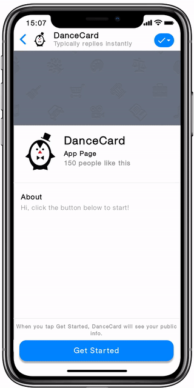

# Vue Bot Scenario

> Declarative syntax for scenarios based on Vue.js templates

## Benefits

- **User Friendly** - reqiures WYSIWYG editor to provide friendly UI for users 
- **Developer Friendly** - reqiured only knowledge of templates in Vue.js
- **Flexible** - based on very simple concept, which can handle complex scerios by providing logical steps (yes/no conditions) and cycles (jump from one to another scenario)

## Example

[See scerario](scenarios/dance-events.vue)




## API

```ts
type IVariable = Any

// Group set of scenarios in one collection
interface Scenarios {
  id: String
  title: String
}

// Define scerario
interface Scenario {
  id: String
  title: String
}

// Define global variable shared between all scenarios
interface Var {
  v-model: IVariable  // Global variable
  val: IVariable      // Set default value
  userInput: Boolean  // Show UI element to accept user input
  then: String        // Scerario id to execute if value is TRUE
  else: String        // Scerario id to execute if value is FALSE
  request: Promise    // Function which returns promise to deliver value
}

// Add text UI element to chat
interface Text {

}

// Play scerario by id
interface Play {
  id: String
}
```
